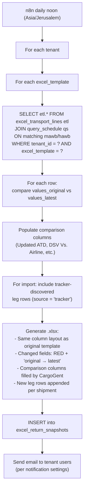
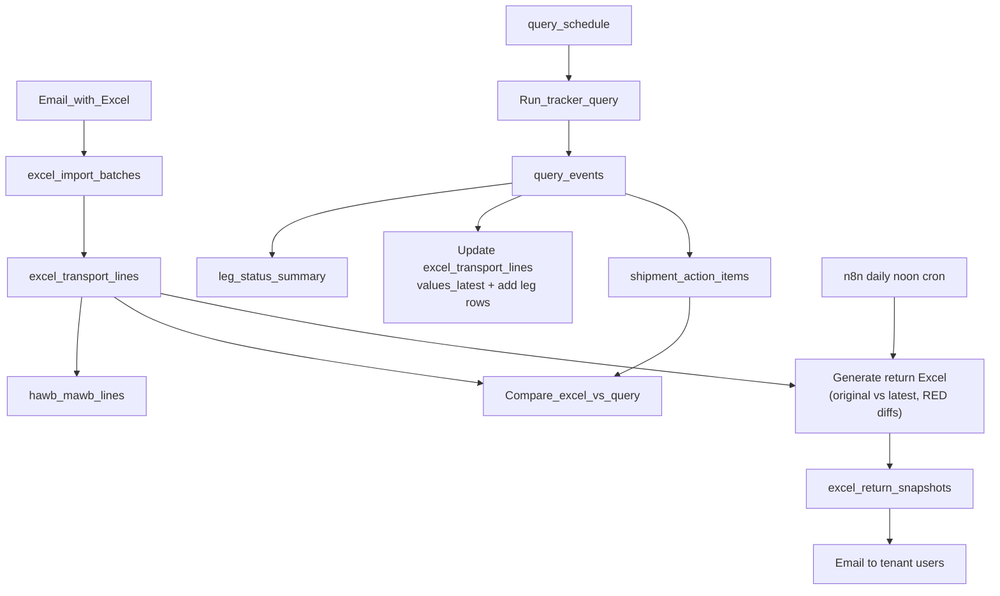

# Ingest Excel + Query to DB — redesigned plan (v2)

This document replaces the earlier plan as the **review source of truth** for database design: email Excel ingest, scheduling, tracker/query events, per-leg rollup, shipment warnings, and the **daily return-Excel** workflow.

**Requirements inputs:** [`export.excel.file.and.requirments.md`](export.excel.file.and.requirments.md), [`PRD.md`](PRD.md).

**Sample workbooks:** `awbs/L2077 - Air Import …xlsx` (business **import** email), `awbs/IL1 Shipment Profile Report …xlsx` (business **export** email).

---

## Versioning model — "Original vs Latest"

This is the single, unified rule that governs all data changes across both import and export:

1. **First ingest** from Excel is the **original (base) data**. It is frozen and never overwritten.
2. **Any subsequent change** — whether from a newer Excel email **or** from a tracker query result — becomes the **latest value**.
3. Only **two versions** are kept: **original** and **latest**.
4. On the return Excel and dashboard, if **latest ≠ original**, the field is flagged (RED in Excel, highlighted on dashboard).

---

## 1. `excel_import_batches` — audit and traceability

**Purpose:** one row per **ingest execution** (typically one attachment from one email).

| Column | Purpose |
|--------|---------|
| `id` | UUID PK |
| `tenant_id` | FK → `tenants` |
| `source_message_id` | Email / message id (provenance) |
| `original_filename` | Attachment name |
| `excel_template` | `il1_shipment_profile` \| `dsv_air_import_l2077` (drives parser) |
| `excel_kind` | Optional label mirroring business "import/export" email |
| `excel_timezone_assumption` | e.g. `Asia/Jerusalem` for serial → `timestamptz` |
| `parser_version` | Bump when column mapping changes |
| `ingested_at` | When ingest finished |

Downstream rows reference `batch_id` so the UI can show **which file / which time** produced the numbers (PRD: excel vs query comparison).

---

## 2. `excel_transport_lines` — all data collected from spreadsheets

**Purpose:** normalized **spreadsheet facts** after parsing. One physical table; **row shape depends on template**:

| Mode | Rows per business shipment |
|------|----------------------------|
| **Export** (`il1_shipment_profile`) | **One row per leg** (same `shipment_id` repeated in the file). |
| **Import** (`dsv_air_import_l2077`) | **One row per shipment** on initial ingest. **Additional leg rows may be added** when tracker discovers intermediate legs. |

**Import semantics (stakeholder — updated):**

- **Initial ingest:** one row per shipment (`leg_sequence = 1`).
- **ETD / ATD** describe the **origin of the first leg**.
- **ETA / ATA** describe **landing in Israel** (last leg into Israel). Store **NULL** when there is no value or when not applicable.
- **Leg expansion:** when the tracker discovers intermediate connection legs, **new rows are added** to `excel_transport_lines` with `leg_sequence = 2..n`, `source = 'tracker'`. These rows appear in the return Excel as additional lines. Early-stage shipments may have ATA = NULL for legs not yet completed.

**Export semantics:**

- Each row carries that leg's **Leg Load / Discharge** and **Leg ATD / Leg ATA** (and repeats shipment-level fields as in the sheet).
- Shipment-level dates/columns from IL1 (`Origin ETD`, `Dest ETA`, weight, outer, etc.) should **fit the same columns** as import where possible (repeated per leg row is acceptable).

### Columns

**Identity & lineage**

- `id` UUID PK
- `tenant_id` FK
- `batch_id` FK → `excel_import_batches` — points at the **latest** batch that touched this row
- `first_batch_id` FK → `excel_import_batches` — freezes the **original** batch (set once, never overwritten)
- `excel_template` (redundant with batch; optional for query speed)
- `shipment_id` TEXT NOT NULL — IL1: `Shipment ID`; L2077: `File Number`
- `job_number` TEXT NULL — L2077: `Job Number`
- `leg_sequence` INT NOT NULL — **Import: starts `1`, may grow**. **Export: `1..n`** per `shipment_id` in stable sheet order
- `source` TEXT NOT NULL DEFAULT `'excel'` — `'excel'` | `'tracker'` — origin of this row (tracker for discovered legs)

**Full original row (for return-Excel regeneration)**

- `raw_excel_row` JSONB NOT NULL — the complete, unprocessed column→value map **exactly as parsed from the Excel** on first ingest. Set once, never overwritten. For tracker-discovered rows, stores the tracker-derived values that first created the row.

**AWB / corridor (both templates)**

- `master_awb` TEXT
- `house_ref` TEXT
- `origin` TEXT NULL — airport / office code; L2077 may derive from `Load Port/Gateway ID`
- `destination` TEXT NULL

**Weights / pieces**

- Operational `weight`, `weight_uq`, `outer_count`, `outer_uq` (types as decided in implementation)
- `pieces_pcs` NUMERIC NULL — L2077 `PCS` as a number
- `chargeable_weight_raw` NUMERIC NULL — L2077 `Ch. Wght`; **future/analytics**

**Dates — import-oriented "first leg origin / Israel landing"**

- `first_leg_etd`, `first_leg_atd` TIMESTAMPTZ NULL — import: from sheet ETD/ATD; export: align to "origin of first leg" policy
- `israel_landing_eta`, `israel_landing_ata` TIMESTAMPTZ NULL — **NULL if no data or not applicable**

**Leg-specific (export primary; import expanded by tracker)**

- `leg_load_port`, `leg_discharge_port` TEXT NULL
- `leg_atd`, `leg_ata` TIMESTAMPTZ NULL — **export:** that row's leg; **import:** may mirror first/last timing or stay NULL except discovered legs
- `leg_etd`, `leg_eta` TIMESTAMPTZ NULL — tracker/export per-leg schedule

**All other Excel columns (import L2077)**

- `customs_file_no` TEXT NULL
- `importer_name` TEXT NULL
- `exporter_name` TEXT NULL
- `incoterms_id` TEXT NULL
- `carrier_id` TEXT NULL
- `carrier_name` TEXT NULL
- `itr_date` TIMESTAMPTZ NULL
- `maman_swissport_departure` TEXT NULL — Hebrew column: `יציאה מממ"ן / סוויספורט`
- `remarks` TEXT NULL
- `remarks_1` TEXT NULL
- `remarks_2` TEXT NULL

**Comparison columns (import L2077) — populated by CargoGent**

These columns exist in the original Excel but **CargoGent populates them** in the return Excel with its own tracker-sourced comparison data:

- `updated_atd` TIMESTAMPTZ NULL — CargoGent writes: tracker's actual departure time (from DEP/MAN event at origin)
- `atd_dsv_vs_airline` TEXT NULL — CargoGent writes: comparison text showing Excel ATD vs tracker ATD
- `updated_eta` TIMESTAMPTZ NULL — CargoGent writes: tracker's scheduled arrival time (from flight schedule)
- `eta_dsv_vs_airline` TEXT NULL — CargoGent writes: comparison text showing Excel ETA vs tracker ETA
- `updated_ata` TIMESTAMPTZ NULL — CargoGent writes: tracker's actual arrival time (from ARR/RCF event at destination)
- `ata_dsv_vs_airline` TEXT NULL — CargoGent writes: comparison text showing Excel ATA vs tracker ATA
- `maman_swissport_intake_date` TIMESTAMPTZ NULL — from Maman/Swissport ground tracker: intake (RCS) event time
- `maman_swissport_release_date` TIMESTAMPTZ NULL — from Maman/Swissport ground tracker: release (DLV) event time
- `release_vs_intake_date` TEXT NULL — CargoGent writes: comparison text showing release vs intake duration

**All other Excel columns (export IL1)**

- `origin_ctry` TEXT NULL
- `dest_ctry` TEXT NULL
- `inco` TEXT NULL
- `additional_terms` TEXT NULL
- `ppd_ccx` TEXT NULL
- `volume` NUMERIC NULL
- `volume_uq` TEXT NULL
- `chargeable` NUMERIC NULL
- `chargeable_uq` TEXT NULL
- `inner_count` NUMERIC NULL
- `inner_uq` TEXT NULL
- `shipment_event` TEXT NULL — `Shipment Event (WHR - %)`

**Versioning (per [`export.excel.file.and.requirments.md`](export.excel.file.and.requirments.md))**

- `values_original` JSONB — snapshot of **all versioned fields** at first ingest. Set once, never overwritten.
- `values_latest` JSONB — current values of versioned fields. Updated on each new Excel or tracker update.
- **Versioned on every leg row** for both import and export. Each leg has independent `values_original` / `values_latest`.
- **Versioned fields (import L2077):** `Ch. Wght`, `PCS`, `ETD`, `ATD`, `ETA`, `ATA`, and the comparison columns (`Updated ATD`, `ATD DSV Vs. ATD AIRLINE`, etc.)
- **Versioned fields (export IL1):** `Weight`, `UQ`, `Outer`, `UQ`, `Origin ETD`, `Dest ETA`, `Leg Load Port`, `Leg Discharge Port`, `Leg ATD`, `Leg ATA`
- Both **Excel re-ingest** and **tracker updates** write to `values_latest`. If it differs from `values_original`, the return Excel marks that field RED.

**Constraints**

- **`UNIQUE (tenant_id, shipment_id, leg_sequence)`** — works for both templates (export has disjoint shipment_id namespace from import).

---

## 3. `hawb_mawb_lines` — shipment to transport mapping

**Purpose:** explicit **many-to-many lookup table** resolving the relationship between a Shipment (HAWB) and Transport (MAWB) as defined in the PRD and System Design. Automatically populated/extracted from `excel_transport_lines` on ingest.

| Column | Purpose |
|--------|---------|
| `tenant_id` | FK |
| `hawb` TEXT NOT NULL | Local shipment reference (e.g., `house_ref` or `shipment_id`) |
| `mawb` TEXT NOT NULL | Master airline reference |
| PRIMARY KEY (`tenant_id`, `hawb`, `mawb`) | Enforce unique pairings |

---

## 4. `query_schedule` (formerly `schelued_tracking_jobs`) — replace `awbs_in_transit`

**Purpose:** drive **when** to run the next tracker/airline query (n8n / worker).

**Stakeholder direction:** **replace** [`awbs_in_transit`](../backend/migrations/001_tenants.sql) with a new scheduling table that uses the **MAWB + HAWB pair**.

| Column | Notes |
|--------|-------|
| `tenant_id` UUID NOT NULL | FK |
| `mawb` TEXT NOT NULL | The Master AWB (transport identity) |
| `hawb` TEXT NOT NULL | The House AWB (shipment identity) |
| `next_status_check_at` TIMESTAMPTZ NOT NULL | Identical meaning as current table |
| PRIMARY KEY (`tenant_id`, `mawb`, `hawb`) | Unique per tracking job pair |

**Migration note:** Drop/replace `awbs_in_transit` with `query_schedule` (or `schelued_tracking_jobs` per system design) using the new multi-column PK. Ground tracking strictly depends on both `mawb` and `hawb`, so they are mandatory.

---

## 5. `query_events` (formerly `shipments_tracking_events`) — events from query / tracker

**Purpose:** **append-only log** of everything returned from manual or scheduled queries (airline + ground), normalized enough for UI and rollups. *(Note: system design referred to this as `shipments_tracking_events`)*

Suggested columns:

| Column | Purpose |
|--------|---------|
| `id` UUID PK | |
| `tenant_id` | |
| `query_run_id` UUID NULL | Groups events from one API call / workflow step |
| `mawb` TEXT NULL | Master AWB from tracker |
| `hawb` TEXT NULL | House AWB from tracker |
| `shipment_id` TEXT NULL | Link to excel business id when known |
| `leg_sequence` INT NULL | When event binds to a leg |
| `provider` TEXT | e.g. airline code, `maman`, `swissport` |
| `source` TEXT | `manual` \| `scheduled` \| `n8n` |
| `occurred_at` TIMESTAMPTZ | Event time from carrier (or receipt time if unknown) |
| `status_code`, `status_text` TEXT | e.g. BKD, RCF, DLV |
| `location` TEXT | IATA / station |
| `weight`, `pieces` TEXT NULL | When event carries them |
| `payload` JSONB | Raw/normalized fragment from tracker |
| `created_at` TIMESTAMPTZ DEFAULT now() | Insert time |

**Accumulation model:** As a shipment progresses geographically, each tracker run appends new events. Events are never deleted or overwritten. A shipment might accumulate BKD → DEP → RCF → NFD → DLV events over its lifetime. Each tracker run may return events already seen (deduplicate by `(mawb, hawb, status_code, occurred_at, location)`).

**Relationship to legacy:** today's `awb_status_history` holds `status` + `status_details JSONB`. **Decision:** `awb_status_history` is **deprecated**. New code writes only to `query_events`. The old table remains read-only and will eventually be dropped.

---

## 6. `leg_status_summary` (formerly `shipments_tracking_summary`) — rolled-up status per leg

**Purpose:** **one row per leg** per shipment for fast UI and rules (PRD tables, stale detection, etc.). *(Note: system design referred to this as `shipments_tracking_summary`)*

Suggested columns:

| Column | Purpose |
|--------|---------|
| `id` UUID PK | |
| `tenant_id` | |
| `shipment_id` TEXT NOT NULL | Business id (`Shipment ID` or `File Number`) |
| `leg_sequence` INT NOT NULL | Align with excel export legs; import uses `1` initially, grows with discovered legs |
| `aggregated_status` TEXT | Derived from events + PRD rules (e.g. in transit vs delivered) |
| `last_event_at` TIMESTAMPTZ | |
| `summary` JSONB | Pieces/weight snapshot, flight, milestones |
| `updated_at` TIMESTAMPTZ | |

**Constraint:** `UNIQUE (tenant_id, shipment_id, leg_sequence)`.

**Computation:** materialized by worker after new `query_events` (and optionally after excel ingest for baseline).

**Relationship to `excel_transport_lines` versioning:** the summary refresh job also updates `values_latest` on `excel_transport_lines` when tracker data provides new values for versioned fields (e.g., tracker returns an actual departure time that differs from the Excel's ETD).

---

## 7. `shipment_action_items` — warnings, issues, action items

**Purpose:** persist **operator/customer-facing alerts** tied to a shipment (PRD: attention table, stale 24h, special treatment, excel vs tracker vs tracker mismatch, etc.).

Suggested columns:

| Column | Purpose |
|--------|---------|
| `id` UUID PK | |
| `tenant_id` | |
| `shipment_id` TEXT NOT NULL | |
| `mawb` TEXT NULL | Optional link to transport |
| `hawb` TEXT NULL | Optional link to shipment |
| `alert_type` TEXT | e.g. `stale_24h`, `excel_query_mismatch`, `tracker_vs_tracker_mismatch`, `special_treatment`, `custom` |
| `severity` TEXT | `info` \| `warning` \| `critical` |
| `title`, `message` TEXT | |
| `source` TEXT | `rule_engine`, `user`, `ingest`, `tracker` |
| `metadata` JSONB | Field-level diffs, thresholds |
| `created_at`, `resolved_at` TIMESTAMPTZ | |
| `is_active` BOOLEAN | Soft-hide when resolved |

**Constraint / indexing:** `(tenant_id, shipment_id)` where `is_active`; partial index for dashboards.

---

## 8. `excel_return_snapshots` — daily return-Excel audit trail

**Purpose:** one row per **generated return Excel**, providing audit trail and delivery tracking.

| Column | Purpose |
|--------|---------|
| `id` UUID PK | |
| `tenant_id` FK | |
| `generated_at` TIMESTAMPTZ NOT NULL | When the Excel was generated |
| `excel_template` TEXT NOT NULL | Which template was used |
| `shipment_count` INT NOT NULL | Total shipments in file |
| `diff_count` INT NOT NULL | How many fields were marked RED |
| `new_legs_count` INT NOT NULL | How many tracker-discovered legs were added |
| `file_path` TEXT NOT NULL | S3/storage path to generated `.xlsx` |
| `sent_to` TEXT[] NOT NULL | Email addresses |
| `sent_at` TIMESTAMPTZ NULL | When email was actually sent |
| `metadata` JSONB NULL | Summary of diffs per shipment |

---

## 9. Return-Excel Workflow (NEW)

**Trigger:** n8n scheduled workflow, daily at noon (tenant timezone).

**Requirements:**

1. The return Excel mirrors the **exact template layout** of the original file (same columns, same order, same headers).
2. All original columns are returned with their **latest** values.
3. If a field's **latest value ≠ original value**, the cell is formatted in **RED** and shows **both** values: `"original → latest"`.
4. **Sources of "latest":** both newer Excel re-ingests **and** tracker query results.
5. **Import leg expansion:** if the tracker discovers intermediate legs not in the original Excel, **new rows are inserted** in the return Excel (matching the same column layout, with as much data as available from the tracker).
6. **Export:** rows match the original 1-per-leg layout; tracker may update dates/status per leg.

### Generation flow

### Diff logic

For each row in `excel_transport_lines`:
1. Parse `values_original` and `values_latest` JSONBs.
2. For each versioned field: if `original[field] != latest[field]` → mark RED, show `"original → latest"`.
3. For non-versioned fields: always show current value (no RED).
4. For tracker-discovered leg rows (`source = 'tracker'`): show all available data, no RED marking (there was no original to compare against).

### Dashboard display (related)

The customer dashboard shows **original vs latest** side-by-side:
- **Latest data** displayed by default in tables.
- **Diff indicators** on fields where `values_original ≠ values_latest`.
- **Shipment detail view:** full breakdown showing original and latest, with date stamps.

This uses the same `values_original` / `values_latest` columns — **same data, different presentation** (dashboard = side-by-side, Excel = RED cell).

---

## Flow (overview)

---

## Tracker → `values_latest` field mapping

When a tracker run returns new events, the summary refresh job updates `values_latest` on `excel_transport_lines` as follows:

| Tracker Event | Excel Field Updated | Notes |
|---------------|--------------------|---------|
| **DEP / MAN** at origin station | `ATD` (import) / `Leg ATD` (export) | Actual departure |
| **ARR / RCF** at destination station | `ATA` (import) / `Leg ATA` (export) | Actual arrival |
| Flight schedule update | `ETD` → `Updated ETD`, `ETA` → `Updated ETA` | When available from airline |
| Weight from airline | `Ch. Wght` (import) / `Weight` (export) | Overwrites if different |
| Pieces from airline | `PCS` (import) / `Outer` (export) | Overwrites if different |
| **Maman/Swissport RCS** | `maman_swissport_intake_date` | Ground intake event |
| **Maman/Swissport DLV** | `maman_swissport_release_date` | Ground release event |
| New intermediate stop discovered | Creates new `excel_transport_lines` row with `source='tracker'` | `leg_load_port`, `leg_discharge_port`, dates from events |

**Comparison columns** (L2077 cols 21-29) are **populated by CargoGent** in both db storage and return Excel:
- `Updated ATD` = tracker's ATD
- `ATD DSV Vs. ATD AIRLINE` = formatted comparison: `"Excel: <original> | Tracker: <tracker>"`
- Same pattern for ETA and ATA columns
- `תאריך קליטה` / `תאריך שחרור` columns = from Maman/Swissport ground tracker events
- `תאריך שחרור Vs. תאריך קליטה` = calculated duration between release and intake

---

## All open points resolved ✓

No remaining open points. All stakeholder decisions have been captured.

---

## Resolved stakeholder inputs captured here

- **Import Israel landing:** `israel_landing_eta`, `israel_landing_ata` — **two columns, NULL** when no data or not applicable.
- **Schedule table:** **replace** `awbs_in_transit` with **`query_schedule`** using **same PK and `next_status_check_at` semantics**.
- **Leg history from trackers:** **latest-only** rollups in `leg_status_summary`; events remain append-only in `query_events`.
- **Excel import/export in one fact table:** `excel_transport_lines` with **export = row per leg**, **import = one row per shipment initially, expandable**.
- **Versioning model:** first Excel = original (base), all subsequent changes (Excel or tracker) = latest. Two versions only.
- **Versioning scope:** per-leg — every leg row has independent `values_original` / `values_latest`.
- **Return Excel format:** mirrors exact original template layout. RED marking for changed fields.
- **Return Excel trigger:** n8n daily noon scheduled workflow, **fixed timezone: Asia/Jerusalem**.
- **Return Excel scope:** only **active shipments** (those present in `query_schedule`, i.e., not yet fully delivered).
- **Import leg expansion:** return Excel expands to show all discovered legs (new rows).
- **Import leg expansion — column inheritance:** tracker-discovered leg rows **inherit** shipment-level columns (Importer Name, Carrier Name, Job Number, etc.) from the parent row (`leg_sequence = 1`). Only leg-specific columns (load port, discharge port, dates) come from the tracker.
- **Dashboard:** shows original vs latest data; same underlying data as return Excel, different presentation.
- **Full column lists:** all columns from both L2077 and IL1 are stored; `raw_excel_row` JSONB preserves the complete original parse.
- **L2077 comparison columns (cols 21-29):** **populated by CargoGent** with its own tracker-sourced comparison data.
- **Tracker → field mapping:** DEP → ATD, ARR/RCF → ATA, weight/pieces overwrite, Maman/Swissport events → intake/release dates.
- **`awb_status_history` table:** **deprecated**. New code writes only to `query_events`. No parallel operation or migration — old table left read-only and eventually dropped.

---

## Implementation todos (for engineering)

1. Migration: create `excel_import_batches`, `excel_transport_lines` (with `raw_excel_row`, `values_original`, `values_latest`, `first_batch_id`, `source`), `hawb_mawb_lines`, `query_schedule` (and drop/rename `awbs_in_transit`), `query_events`, `leg_status_summary`, `shipment_action_items`, `excel_return_snapshots`; indexes and FKs.
2. Ingest parsers writing to batches + lines; extract into `hawb_mawb_lines`; TZ + versioning rules; populate `raw_excel_row` and `values_original` on first ingest.
3. Wire n8n / backend to `query_schedule`, append `query_events`, refresh `leg_status_summary`, update `values_latest` on `excel_transport_lines`, generate discovered-leg rows, generate `shipment_action_items`, PRD compare with excel lines.
4. **New:** n8n daily noon workflow: query `excel_transport_lines`, diff `values_original` vs `values_latest`, generate return Excel with RED formatting, store in `excel_return_snapshots`, email to tenant users.
